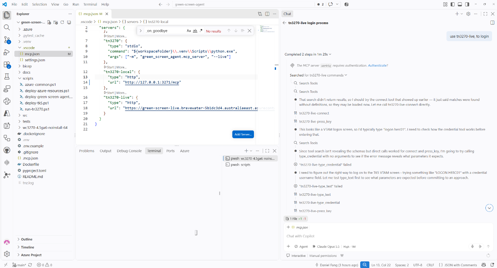
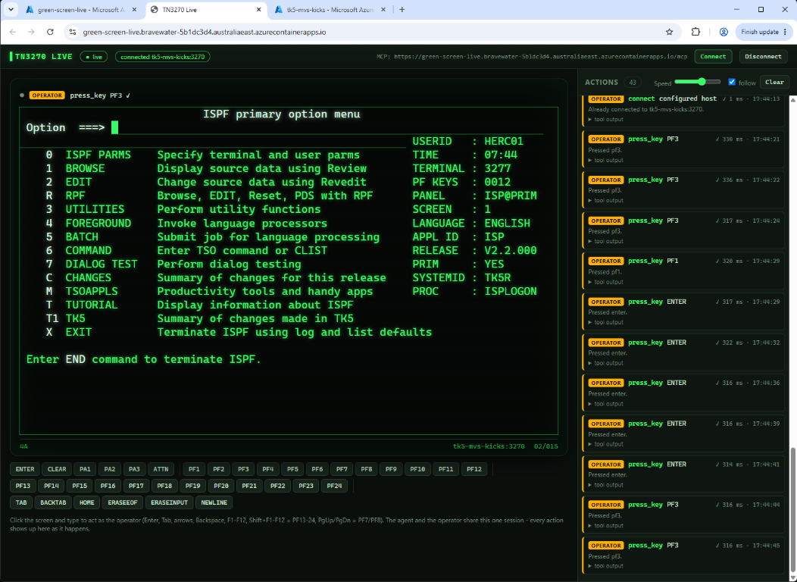
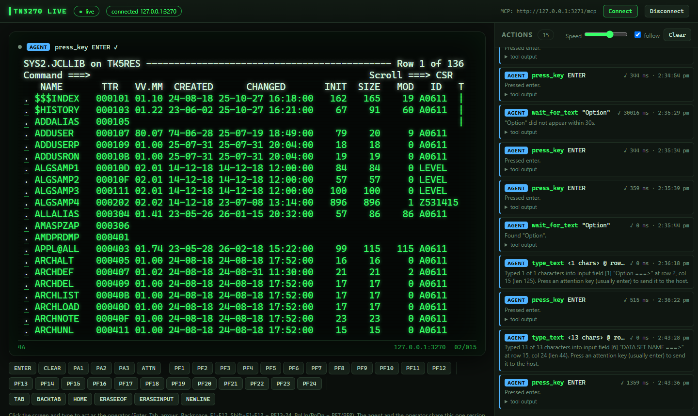

# green-screen-agent

Let AI agents operate IBM 3270 **green-screen** (TN3270) applications directly over the
TN3270 protocol. No screenshots, OCR or emulator GUI: the agent reads the 3270 screen
buffer (text + input fields) and types into fields / presses AID keys like an operator.

The same tool set is exposed two ways:

| Front end | How | Module |
|---|---|---|
| **Microsoft Foundry agent** (Python, `azure-ai-projects` 2.x prompt agent) | function tools executed locally | `green_screen_agent.foundry_agent` |
| **GitHub Copilot CLI / VS Code** | MCP server (stdio) | `green_screen_agent.mcp_server` |
| **Live green screen** (browser) | web view + MCP streamable HTTP on one shared session | `green_screen_agent.live` |

A **TN3270 host simulator** with a small CICS-style customer application is included for
testing, and the tools were also verified against a real MVS 3.8j system (TK5 in Docker).
See [docs/research.md](docs/research.md) for the options that were evaluated.

Tools: `connect`, `read_screen`, `type_text`, `type_credential`, `press_key`,
`wait_for_text`, `disconnect`.

These are terminal primitives, not application actions. Copilot is not given simulator
objects, customer operations, menu metadata or a side-channel API. The simulator exposes
only its TN3270 TCP listener: it encodes each screen as a 3270 data stream and changes
application state only after parsing an inbound TN3270 record. Consequently, the agent
must discover options from the actual received screen buffer, decide what to do, type into
3270 fields, send an AID key, and verify the next received screen. The same path is used
against the simulator and a real mainframe.

## Demo: green screen controlled by Copilot via MCP

GitHub Copilot in VS Code drives the TK5 mainframe through the `tn3270-live` MCP server
(`connect`, `type_text`, `type_credential`, `press_key`, ...):



Each agent interaction is visualised in the live green screen: the ISPF screen as the host
sent it, with every tool call in the action log alongside it:



## Quick start

```bash
python -m venv .venv && . .venv/bin/activate
pip install -e ".[foundry,dev]"
cp .env.example .env          # set TN3270_USERNAME=DEMO and TN3270_PASSWORD=DEMO123 for the simulator

python -m green_screen_agent.simulator          # TN3270 simulator on 127.0.0.1:3270 (sign on DEMO / DEMO123)
pytest                                           # unit + end-to-end tests (simulator, MCP, Foundry loop)
```

Any 3270 emulator (x3270, c3270, wc3270) can connect to the simulator to see the same screens.

### GitHub Copilot CLI

`.mcp.json` in the repository root registers the `tn3270` MCP server (Copilot CLI loads it
for trusted folders). Start Copilot from the repo with the package installed:

```bash
copilot --allow-tool='tn3270'
> Connect to the green screen, sign on, and tell me the status and balance of customer 100003.
```

For `copilot -p` (non-interactive) set `GITHUB_COPILOT_PROMPT_MODE_WORKSPACE_MCP=true`.
In VS Code, `.vscode/mcp.json` starts the same server (agent mode) using `.env`.

### Live green screen: watch the agent work

Open a browser on the agent's 3270 session and watch every action as it happens: each
tool call appears in an action log (with the screen returned to the agent), typed text is
animated keystroke by keystroke into its field, AID keys flash on screen with the `X SYSTEM`
lock indicator while the host responds, and every screen the host sends is redrawn. You can
also act as the operator on the same connection: click the screen and type, use Tab/arrows,
Enter, F1-F12 (Shift = PF13-24) or the keypad, Connect/Disconnect. The log tags each entry
`AGENT` or `OPERATOR`. Passwords never reach the page (non-display fields are blanked).



There are two ways to run it. Both serve one shared terminal session.

1. **Built into the MCP server** (the default in `.mcp.json` and `.vscode/mcp.json`):
   `python -m green_screen_agent.mcp_server --live [PORT]` serves the session that Copilot
   is driving at <http://127.0.0.1:3271/>. If the port is taken, a free port is used; the
   URL is logged to stderr (the MCP server output in VS Code).
2. **Standalone front end that owns the connection**, with agents attaching over MCP HTTP.
   The session stays open across agent runs, and several clients can share it:

   ```bash
   python -m green_screen_agent.live            # or: green-screen-live [--port 3271] [--connect]
   # UI:  http://127.0.0.1:3271/
   # MCP: http://127.0.0.1:3271/mcp  (streamable HTTP)
   ```

   Point the client at the HTTP endpoint instead of the stdio server, e.g. VS Code
   `.vscode/mcp.json`: `"tn3270": {"type": "http", "url": "http://127.0.0.1:3271/mcp"}`, or
   Copilot CLI `.mcp.json`: `"tn3270": {"type": "http", "url": "http://127.0.0.1:3271/mcp", "tools": ["*"]}`.

The page receives events over Server-Sent Events (`/events`). Operator actions go through
`/api/tool` (the same tools the agent uses) and `/api/keyboard` (raw keystrokes and cursor
moves). Other observers can subscribe in Python with `Tn3270Terminal.add_listener`.

### Microsoft Foundry agent

Needs a Foundry project, a model deployment and `az login` (DefaultAzureCredential):

```bash
export FOUNDRY_PROJECT_ENDPOINT=https://<resource>.services.ai.azure.com/api/projects/<project>
export FOUNDRY_MODEL_NAME=gpt-4.1
green-screen-agent -v -p "Sign on and list the customers that are on HOLD"
green-screen-agent --confirm-keys        # interactive; approve every key sent to the host
```

The agent version is created on start and deleted on exit (`--keep-agent` keeps it).
The model runs in Foundry; the 3270 session and credentials stay in this process.

### Real mainframe for testing (MVS 3.8j TK5 + KICKS)

The Docker image is `linux/amd64` only. On Windows PowerShell, use the launcher below;
it explicitly enables Docker's x86-64 emulation when the host is ARM64:

```powershell
.\scripts\run-tn3270.ps1
# Wait ~2 minutes for the IPL; users HERC01 / CUL8TR
$env:TN3270_USERNAME="HERC01"
$env:TN3270_PASSWORD="CUL8TR"
copilot --allow-tool='tn3270'
```

The equivalent Docker command is:

```powershell
docker run -d --platform linux/amd64 --name mvs-kicks -p 3270:3270 -p 8038:8038 backscratcher/tk5-mvs-kicks:latest
```

On macOS or Linux:

```bash
docker run -d --platform linux/amd64 --name mvs-kicks -p 3270:3270 -p 8038:8038 backscratcher/tk5-mvs-kicks:latest
TN3270_USERNAME=HERC01 TN3270_PASSWORD=CUL8TR copilot --allow-tool='tn3270'
```

Always `LOGOFF` from TSO - a dropped connection leaves the user "in use" until restart.

Port 3270 opens the TK5 VTAM `Logon ===>` screen, not CICS. KICKS (the CICS-compatible
transaction monitor) runs inside a TSO session, so start it from there:

1. At `Logon ===>` sign on as `HERC01` / `CUL8TR`. This lands in the ISPF menu.
2. Exit ISPF (`X` or PF3) to the TSO `READY` prompt.
3. Enter `EXEC KICKSSYS.V1R5M0.CLIST(KICKS)`. The KICKS logo (KSGM) appears.
4. Press CLEAR until the screen is blank, type a transaction id at the top left and press
   Enter: `BTC0` (Nevada Dept. of Labor demo), `MENU` (Murach customer sample) or `KSGM`.
5. To leave, clear the screen and enter `KSSF` (back to `READY`), then `LOGOFF`.

### Deploy to Azure Container Apps

Two container apps in one Container Apps environment:

| App | Image | Ingress |
|---|---|---|
| `tk5-mvs-kicks` | `backscratcher/tk5-mvs-kicks:latest` (imported into ACR) | public TCP 3270, IP-restricted (default: your public IP) |
| `green-screen-live` | this repo's `Dockerfile` (built in ACR) | public HTTPS: live UI at `/`, MCP at `/mcp` |

The shared resources (Log Analytics, Container Registry, managed identity with AcrPull,
virtual network, VNet-integrated Container Apps environment) are defined in
[bicep/main.bicep](bicep/main.bicep). External TCP ingress needs the VNet; re-running
`deploy-azure-resources.ps1` against an environment created without one deletes and recreates
it (and its apps), so re-run the two app scripts afterwards.

```powershell
az login
.\scripts\deploy-azure-resources.ps1      # resource group rg-green-screen-agent + bicep\main.bicep (australiaeast)
.\scripts\deploy-tk5.ps1                  # TK5 MVS + KICKS; IPL takes ~2 minutes
$env:TN3270_PASSWORD = "CUL8TR"           # stored as a Container Apps secret
.\scripts\deploy-green-screen-agent.ps1   # prints the live UI and MCP URLs
```

Point Copilot CLI or VS Code at the printed MCP URL, for example
`"tn3270": {"type": "http", "url": "https://<fqdn>/mcp", "tools": ["*"]}`.
Connect a 3270 emulator to the TK5 address printed by `deploy-tk5.ps1`
(for example `wc3270 <tk5-fqdn>:3270`). Only the IPs passed in `-AllowedIpRange` can connect.
The default is the public IP of the machine that ran the script, so re-run the script from a new location.
All scripts accept `-ResourceGroup` and `-Subscription`; re-run them to update.
The live app has no authentication, so anyone with its URL can drive the TK5 session.
Delete everything with `az group delete -n rg-green-screen-agent`.

## Security notes

- Passwords are typed by `type_credential` from configuration, only into non-display
  fields, and are never returned to the model. Use a least-privilege service user.
- `connect` only reaches `TN3270_HOST` unless `TN3270_ALLOWED_HOSTS` allows more.
- Screen text is untrusted input (prompt injection); the instructions tell the model to
  treat it as data. Use `--confirm-keys` (Foundry) or Copilot's tool approvals for
  write operations, and TLS (`TN3270_TLS=true`, port 992) outside a lab.
- The live view drives a real session, so it listens on 127.0.0.1 only by default and rejects
  requests with a foreign `Host` or `Origin` header (DNS rebinding / cross-site requests).
  It has no login: any local process can use it. Do not use `--host 0.0.0.0` on an untrusted network.
