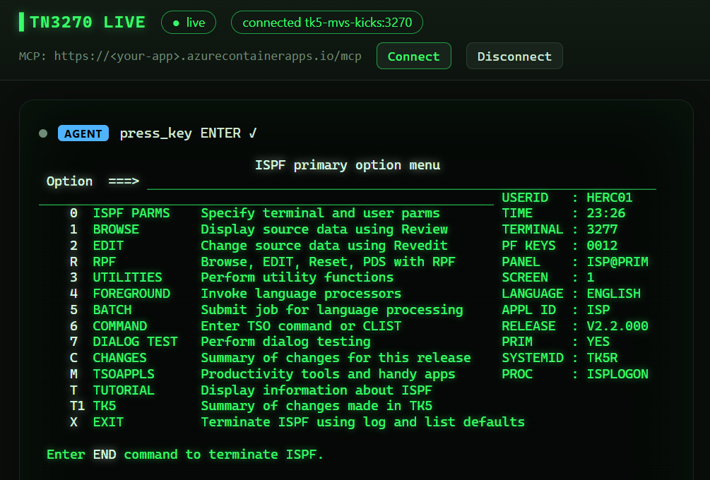

# I gave an AI agent a green screen. 🟩🤖

A lot of critical work still runs on IBM mainframes. People do it by typing into TN3270 green screens: CICS transactions, TSO, ISPF, customer look-ups and updates. These systems aren't going anywhere soon.

So I wanted to know: **can an AI agent work a green screen like a careful human operator would?**

It turns out it can. Here's GitHub Copilot in VS Code signing on to a real MVS 3.8j mainframe through an MCP server I built:


---

## 🤔 Why build an MCP server for TN3270?

These were my constraints:
- Users work in TN3270 green screens
- Systems talk to each other over MQ, but that only covers well-defined transactions
- There's no SSH, and SSH isn't the user interface anyway

I looked at a few options:

❌ **Computer use / screenshots**: works with any UI, but it's slow and costly, OCR misreads dense 80x24 screens, and it needs a desktop VM.

⚠️ **MQ integration**: great for production system-to-system flows. It doesn't cover the long tail of screens people actually use.

✅ **Speak TN3270 directly**: a headless 3270 terminal in Python (IBM's `tnz`). The agent gets the exact screen buffer as text, plus field boundaries, protected and hidden attributes, and keyboard lock state. No pixels and no guessing. It's fast, cheap, deterministic and testable.

GitHub Copilot can't speak TN3270, but it can call **MCP servers**. So I wrapped the terminal in one.

## 🛠️ The tools: terminal primitives, not shortcuts

The MCP server exposes 7 tools:

`connect` · `read_screen` · `type_text` · `type_credential` · `press_key` · `wait_for_text` · `disconnect`

I made a deliberate choice here: **no application-specific APIs.** The agent gets no "get customer" tool and no menu metadata. It has to read the screen the host sent, decide what to do, type into the fields, press Enter or a PF key, and then check the next screen. It works the same way as a human operator, and it uses the same code path against a simulator and a real mainframe.

## 🤖 The agent use case

> "Connect to the green screen, sign on, and tell me the status and balance of customer 100003."

The agent connects, signs on, navigates the menu, runs the inquiry, reads the result and answers in plain English.

Some other things you can ask:
- "List the customers that are on HOLD" (it pages through with PF8)
- "Log on to TSO, open ISPF and browse SYS2.JCLLIB"
- Repetitive look-ups and data checks that take people hours of keystrokes

## 👀 Watch it work: TN3270 Live

An agent driving a mainframe needs to be **observable**. So the MCP server also runs a live web view of the same 3270 session. Every tool call appears in an action log. Typed text animates keystroke by keystroke, and AID keys flash with the `X SYSTEM` lock indicator while the host responds:


You can also take over as the operator on the same connection. Each log entry is tagged `AGENT` or `OPERATOR`. Passwords never reach the page.


---

## 🐳 A real mainframe in Docker

You don't need access to a production z/OS system to try this. **TK5** (MVS 3.8j Turnkey 5, running on the Hercules emulator) comes with **KICKS**, a CICS-compatible transaction monitor, in one container. It has real VTAM, TSO and ISPF.

```bash
docker run -d --platform linux/amd64 --name mvs-kicks \
  -p 3270:3270 -p 8038:8038 backscratcher/tk5-mvs-kicks:latest
# wait ~2 minutes for the IPL, then sign on as HERC01 / CUL8TR
```

On Windows, `.\scripts\run-tn3270.ps1` does the same thing, and it enables x86-64 emulation on ARM64 machines.

For fast automated tests, the repo also includes a **TN3270 simulator** with a small CICS-style customer app (sign on `DEMO` / `DEMO123`). It speaks only the 3270 data stream and has no side-channel APIs.

## ☁️ Running it on Azure

Next I moved both pieces into **Azure Container Apps**, so the mainframe and the agent endpoint run in the cloud:

| Container App | What it runs | Ingress |
|---|---|---|
| `tk5-mvs-kicks` | TK5 MVS 3.8j + KICKS (2 vCPU / 4 GiB) | TCP 3270, IP-restricted |
| `green-screen-live` | Live green screen + MCP streamable HTTP (0.5 vCPU / 1 GiB) | HTTPS: UI at `/`, MCP at `/mcp` |

Shared infrastructure is in **Bicep** (`bicep/main.bicep`):
- **Azure Container Registry** (Basic, admin user off): builds the agent image with `az acr build` (no local Docker needed) and holds an imported copy of the TK5 image (no Docker Hub pulls at runtime)
- **User-assigned managed identity** with AcrPull, so image pulls don't need registry passwords
- A **VNet-integrated Container Apps environment**, which external TCP ingress on port 3270 requires. The agent reaches the mainframe internally at `tk5-mvs-kicks:3270`.
- **Log Analytics** for container logs
- **Container Apps secret** for the TN3270 password, which is never stored as a plain environment variable

### 📦 Deployed image versions

| App | Image |
|---|---|
| `green-screen-live` | `<acr>.azurecr.io/green-screen-agent:ec4dbe0-20261008170912` (from `python:3.12-slim`, non-root user 10001) |
| `tk5-mvs-kicks` | `<acr>.azurecr.io/tk5-mvs-kicks@sha256:2ea34d91dd63…acaa8`, imported from `backscratcher/tk5-mvs-kicks:latest` and pinned by digest |

The agent image is tagged with `<git commit>-<timestamp>`, so every deployment can be traced to a commit. The TK5 image is pinned by digest, so re-running the script restarts the mainframe only when the upstream image has changed.

Here's the deployed version in action. GitHub Copilot connects through the Azure-hosted MCP endpoint, signs on to TSO and lands in ISPF. The mainframe identifies its host as **Hercules 4.9.1 running on Azure Linux 3**. That's a 1980s operating system running on a cloud container, driven by an AI agent:



---

## 🧑‍🏫 Try it yourself: a step-by-step guide

**1️⃣ Install**
```bash
git clone https://github.com/qkfang/green-screen-agent && cd green-screen-agent
python -m venv .venv && . .venv/bin/activate
pip install -e ".[foundry,dev]"
cp .env.example .env
```

**2️⃣ Start a host.** Pick one:
```bash
python -m green_screen_agent.simulator     # simulator on 127.0.0.1:3270, DEMO / DEMO123
# or the real thing:
docker run -d --platform linux/amd64 --name mvs-kicks -p 3270:3270 backscratcher/tk5-mvs-kicks:latest
```
Set `TN3270_USERNAME` and `TN3270_PASSWORD` in `.env` to match.

**3️⃣ Run the tests**
```bash
pytest     # unit and end-to-end tests: simulator, MCP and the Foundry agent loop
```

**4️⃣ Connect Copilot.** `.mcp.json` (Copilot CLI) and `.vscode/mcp.json` (VS Code agent mode) already register the `tn3270` MCP server with `--live`:
```bash
copilot --allow-tool='tn3270'
> Connect to the green screen, sign on, and tell me the status and balance of customer 100003.
```
Open **http://127.0.0.1:3271/** to watch the agent work.

**5️⃣ (Optional) Use a Microsoft Foundry agent instead**
```bash
export FOUNDRY_PROJECT_ENDPOINT=https://<resource>.services.ai.azure.com/api/projects/<project>
export FOUNDRY_MODEL_NAME=gpt-4.1
green-screen-agent --confirm-keys -p "Sign on and list the customers that are on HOLD"
```
The model runs in Foundry, while the 3270 session and credentials stay in your process.

**6️⃣ (Optional) Deploy to Azure**
```powershell
az login
.\scripts\deploy-azure-resources.ps1      # resource group + Bicep (australiaeast)
.\scripts\deploy-tk5.ps1                  # TK5 MVS + KICKS, IPL takes ~2 minutes
$env:TN3270_PASSWORD = "CUL8TR"
.\scripts\deploy-green-screen-agent.ps1   # prints the live UI and MCP URLs
```
Then point Copilot at the deployed endpoint:
```json
"tn3270": { "type": "http", "url": "https://<your-app>.azurecontainerapps.io/mcp", "tools": ["*"] }
```
When you're done, clean up with `az group delete -n rg-green-screen-agent`.

💡 *Tip: always `LOGOFF` from TSO. A dropped connection leaves the user marked "in use" until the system restarts.*

---

## 🔐 Guardrails

- Passwords are typed by `type_credential` from config, only into non-display fields, and **never returned to the model**
- A host allow-list for `connect` (`TN3270_ALLOWED_HOSTS`)
- Screen text is treated as untrusted input (prompt-injection aware)
- Human approval for keys sent to the host (`--confirm-keys`, or Copilot tool approvals)
- TLS on port 992 outside the lab
- On Azure, the TN3270 port is IP-restricted. The live UI and MCP endpoint have no built-in authentication yet, so add Container Apps authentication or IP restrictions before you share the URL.

## 💡 Takeaway

You don't need to modernise a mainframe app before AI can help with it. **Give the agent the same interface the humans use, at the protocol level, and MCP makes it work with any agent.** Copilot, Foundry, or the next one. Add Docker and Azure Container Apps, and the whole lab is a few scripts away.

The green screen just got a new operator. 🟩🤖

🔗 github.com/qkfang/green-screen-agent

#Mainframe #TN3270 #MCP #GitHubCopilot #Azure #AzureContainerApps #MicrosoftFoundry #Docker #AIAgents #LegacyModernization #COBOL #CICS
